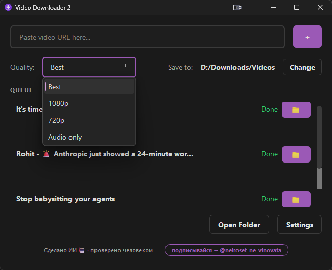

<div align="center">

# 🎬 Video Downloader 2

**A simple, beautiful video downloader for YouTube, VK, and 1000+ sites.**

[English](#english) | [Русский](#русский-версия)

[](../../releases/latest)

[](LICENSE)


<!-- Replace with actual screenshot -->

</div>

---

## English

### ✨ Features

- 🎥 **Download from YouTube, VK, and 1000+ sites** — powered by [yt-dlp](https://github.com/yt-dlp/yt-dlp)
- 📺 **Quality selection** — Best, 1080p, 720p, or Audio only (MP3)
- 📋 **Download queue** with parallel downloads
- 🔔 **Completion notifications** with sound
- 🔄 **yt-dlp auto-update** from Settings
- 🌐 **Bilingual interface** — English & Russian
- 🎨 **Dark theme** with teal accent (#2EC4B6)
- 📦 **Bundled ffmpeg and Node.js** (Windows) — no extra installs needed
- 🍪 **Cookie import** for age-restricted and private videos

### 📥 Download

| Platform | File | Instructions |
|----------|------|--------------|
| Windows  | `VideoDownloader2-Windows.zip` | Extract and run the `.exe` |
| macOS    | `VideoDownloader2-macOS.dmg`   | Open and drag to Applications |

**[⬇ Download Latest Release](../../releases/latest)**

### 🔨 Build from Source

#### Windows

```bash
pip install -r requirements.txt
pyinstaller build.spec
```

#### macOS

```bash
git checkout mac
pip install -r requirements.txt
iconutil -c icns assets/icon.iconset -o assets/icon.icns
pyinstaller build_mac.spec
```

### 🤝 Credits

Created by [@AiVideoDownloader](https://t.me/AiVideoDownloader) · Written by AI 🤖

Built with [PyQt6](https://www.riverbankcomputing.com/software/pyqt/) and [yt-dlp](https://github.com/yt-dlp/yt-dlp).

---

## Русский версия

### ✨ Возможности

- 🎥 **Загрузка с YouTube, VK и 1000+ сайтов** — на базе [yt-dlp](https://github.com/yt-dlp/yt-dlp)
- 📺 **Выбор качества** — Лучшее, 1080p, 720p или Только аудио (MP3)
- 📋 **Очередь загрузок** с параллельным скачиванием
- 🔔 **Уведомления о завершении** со звуком
- 🔄 **Автообновление yt-dlp** из Настроек
- 🌐 **Двуязычный интерфейс** — Английский и Русский
- 🎨 **Тёмная тема** с бирюзовым акцентом (#2EC4B6)
- 📦 **Встроенные ffmpeg и Node.js** (Windows) — дополнительная установка не требуется
- 🍪 **Импорт cookies** для видео с возрастными ограничениями и приватных видео

### 📥 Скачать

| Платформа | Файл | Инструкция |
|-----------|------|------------|
| Windows   | `VideoDownloader2-Windows.zip` | Распакуйте и запустите `.exe` |
| macOS     | `VideoDownloader2-macOS.dmg`   | Откройте и перетащите в Applications |

**[⬇ Скачать последний релиз](../../releases/latest)**

### 🔨 Сборка из исходников

#### Windows

```bash
pip install -r requirements.txt
pyinstaller build.spec
```

#### macOS

```bash
git checkout mac
pip install -r requirements.txt
iconutil -c icns assets/icon.iconset -o assets/icon.icns
pyinstaller build_mac.spec
```

### 🤝 Авторы

Создано [@AiVideoDownloader](https://t.me/AiVideoDownloader) · Написано ИИ 🤖

Сделано с [PyQt6](https://www.riverbankcomputing.com/software/pyqt/) и [yt-dlp](https://github.com/yt-dlp/yt-dlp).

---

## License / Лицензия

MIT
