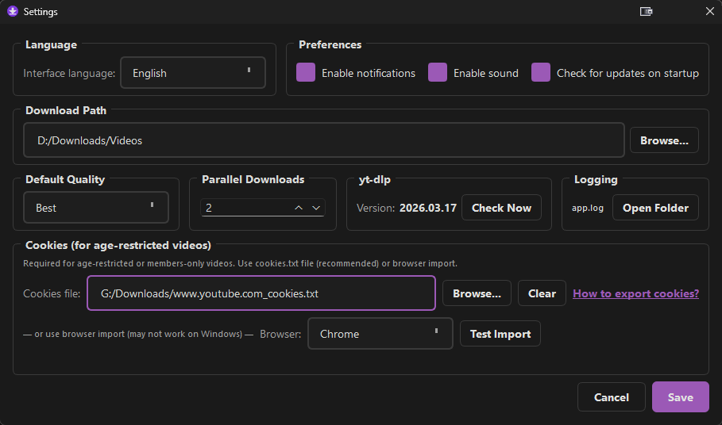

<div align="center">

# 🎬 Video Downloader 2

**Простой и приятный десктоп-загрузчик видео с YouTube, VK и 1000+ сайтов.**

[English](README.md) · **Русский**

[](../../releases/latest)

[](LICENSE)


</div>

---

Video Downloader 2 — небольшое десктоп-приложение для скачивания видео и аудио с YouTube, VK и 1000+ других сайтов. По сути это удобная оболочка над [yt-dlp](https://github.com/yt-dlp/yt-dlp) со встроенными `ffmpeg` и `Node.js` (на Windows), так что больше ничего ставить не нужно — вставьте ссылку и качайте.

## ✨ Возможности

- 🎥 **Загрузка с YouTube, VK и 1000+ сайтов** — на базе [yt-dlp](https://github.com/yt-dlp/yt-dlp)
- 📺 **Выбор качества** — Лучшее, 1080p, 720p или Только аудио (MP3)
- 📋 **Очередь загрузок** с параллельным скачиванием
- 🔔 **Уведомления о завершении** со звуком
- 🔄 **Автообновление yt-dlp** из Настроек
- 🌐 **Двуязычный интерфейс** — английский и русский
- 🎨 **Тёмная тема** с фиолетовым акцентом (`#9b59b6`)
- 📦 **Встроенные ffmpeg и Node.js** (Windows) — дополнительная установка не требуется
- 🍪 **Импорт cookies** для видео с возрастными ограничениями и только для участников

## 📥 Скачать

Свежая сборка — на **[странице релизов](../../releases/latest)**.

- **Windows** — скачайте `VideoDownloader2-Windows.zip`, распакуйте и запустите `VideoDownloader2.exe`. При первом запуске SmartScreen может показать *«Windows защитила ваш компьютер»* — нажмите **Подробнее → Выполнить в любом случае**. Сборка без цифровой подписи (если хотите — соберите сами, см. [Сборка из исходников](#-сборка-из-исходников)).
- **macOS** — скачайте `VideoDownloader2-macOS.dmg`, откройте и перетащите **VideoDownloader2.app** в Applications. При первом запуске macOS может сказать, что приложение *«повреждено и его нельзя открыть»* — оно не повреждено, просто не подписано и помещено в карантин. Снимите карантин в Терминале:

  ```bash
  xattr -d com.apple.quarantine /Applications/VideoDownloader2.app
  ```

  (Если будет ошибка доступа — `sudo xattr -cr /Applications/VideoDownloader2.app`.) После этого приложение откроется как обычно.

## 🍪 Cookies — для YouTube они почти наверняка понадобятся

Можно попробовать скачивать без cookies — для многих видео всё работает сразу. Но рано (скорее, чем поздно) YouTube подсунет видео, которое откажется качаться («Sign in to confirm you're not a bot», возрастное ограничение, только для участников). Это защита YouTube от ботов, **а не баг приложения**. Решение — один раз загрузить ваши cookies с YouTube, и загрузки снова работают.

> ⚠️ **Важно:** YouTube обновляет cookies в открытых вкладках. Экспортируйте их из **приватного/инкогнито окна**, чтобы файл остался рабочим.

**Как экспортировать cookies (Chrome, Edge, Firefox):**

1. Установите расширение **[Get cookies.txt LOCALLY](https://chromewebstore.google.com/detail/get-cookiestxt-locally/cclelndahbckbenkjhflpdbgdldlbecc)**. *(Firefox: [возьмите из Firefox Add-ons](https://addons.mozilla.org/en-US/firefox/addon/get-cookies-txt-locally/).)*
2. Откройте **приватное/инкогнито окно** и войдите на YouTube.
3. В **той же вкладке** перейдите на `https://www.youtube.com/robots.txt`.
4. Нажмите на иконку расширения → **экспорт cookies** → сохраните как `cookies.txt`.
5. **Закройте приватное окно** (чтобы cookies не обновились).
6. В Video Downloader 2 откройте **Настройки → Cookies → Обзор…** и выберите сохранённый файл.



Расширение с открытым исходным кодом и никуда не отправляет ваши данные: [github.com/kairi003/Get-cookies.txt-LOCALLY](https://github.com/kairi003/Get-cookies.txt-LOCALLY).

> 🔒 Файл `cookies.txt` — это активный ключ к вашему аккаунту. Не делитесь им и удалите, когда закончите. Если качаете много — используйте отдельный аккаунт Google.

## 🔨 Сборка из исходников

#### Windows

```bash
pip install -r requirements.txt
pyinstaller build.spec --noconfirm
```

#### macOS

```bash
pip install -r requirements.txt
iconutil -c icns assets/icon.iconset -o assets/icon.icns
pyinstaller build_mac.spec --noconfirm
```

> Точные релизные сборки (со встроенными `ffmpeg`, `ffprobe` и `node`) — см. [`.github/workflows/release.yml`](.github/workflows/release.yml).

## 🤝 Авторы

Сделано ИИ 🤖 · проверено человеком.

Сделано на [PyQt6](https://www.riverbankcomputing.com/software/pyqt/) и [yt-dlp](https://github.com/yt-dlp/yt-dlp).

## 👤 Автор

Сделал [Егор Соколов](https://egorsokolov.ru/) — 10 лет в продукте (Сбер, Рольф, Клаустрофобия). Пишу и экспериментирую с AI-инструментами — в основном Claude Code, Codex и тулинг для разработки.

Телеграм-канал про AI-инструменты: **[@neiroset_ne_vinovata](https://t.me/neiroset_ne_vinovata)**
Подписаться: [t.me/+SzDNKr86V2tkYzM6](https://t.me/+SzDNKr86V2tkYzM6)

Другие open-source эксперименты:

- [Handy-custom](https://github.com/egsok/Handy-custom) — личный форк Handy под русский, офлайн-распознавание речи.
- [plan-tango](https://github.com/egsok/plan-tango) — цикл взаимной проверки планов Claude ↔ Codex для Claude Code.

## Лицензия

MIT — см. [LICENSE](LICENSE). Copyright (c) 2026 Egor Sokolov.
